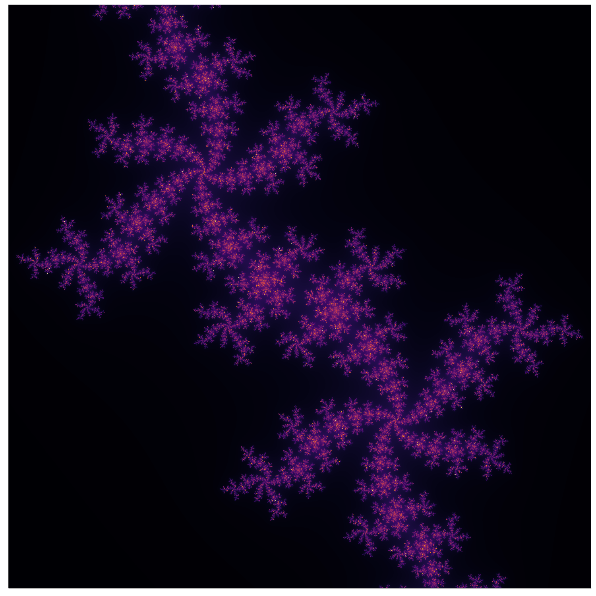

# Julia Set Fractal
### The Julia Set Fractal generated and animated with julia. Benchmarked against Python.

By Oscar Bennett

## Overview

I used the [julia programming language](https://julialang.org) to generate julia sets and to plot and animate the beautiful [fractal patterns](https://en.wikipedia.org/wiki/Fractal) that the set produces. I chose julia because its an interesting and fairly new language designed to be easy to use and extremely efficient for numerically intensive calculations. I also implemented the same program in Python in a range of different ways to compare run times. See below for my benchmark runs.

<p align="center"></p>

## The Julia Set

A nice explanation of what the julia set is can be found [here](https://www.karlsims.com/julia.html). Specifically I looked at julia sets of the function f(z) = z^2 + c where z and c are complex. Different sets and different patterns are produced by setting c to different values. x and y position in the image correspond to the real and imaginary parts of z (z = x +iy). The above is an example of a julia set created with the setting `c = -0.5 + 0.61i`.

Creating these sets with julia was so fast (seconds) I was able generate a whole sequence of julia sets whilst gradually changing the value of c. This allowed me to generate an animation of the fractal structure morphing as c changed:

<p align="center"></p>

## How To Run

If you want to run this code to generate and plot your own julia fractal:
- [Install Julia](https://julialang.org/downloads/) and [add it to your path](https://en.wikibooks.org/wiki/Introducing_Julia/Getting_started)
- Use the julia package manager `Pkg` to install the `Plots` package. Comprehensive instructions [here](https://docs.julialang.org/en/v1/stdlib/Pkg/index.html), but a brief summary: In your command line type `julia`, type `]`, type `add Plots`, type `backspace`, type `exit()` and you're done.
- clone this repo and cd into it
- run `julia julia_set.jl`
- run `julia plot_julia_set.jl`

A `julia_set.png` file will then be generated with a picture of your fractal!

## Variable Parameters

There are a few variable parameters in the `julia_set.jl` code which are set to sensible values but could be altered if you wish. Have a play with them and see how they affect the pattern.
```julia
c = complex(-0.5, 0.61) # constant in the z^2 + c function

im_width, im_height = 5000, 5000  # dimensions of image
max_it = 300  # maximum number of function repeats before assuming divergence does not happen
max_z2 = 100  # Value of f(z) which means the function has diverged
min_x, max_x = -1, 1  # range of x (in z = x + iy) to iterate through
min_y, max_y = -1, 1  # range of y (in z = x + iy) to iterate through
```

## How to Make an Animation

If you would also like to produce a fractal animation:
- Check if you have [ffmpeg](https://www.ffmpeg.org) installed. If not, install it.
- run `cd video`
- run `julia julia_sets.jl`
- run `julia make_video.jl`

A `julia_video.gif` file will be generated with an animation of your fractal.

## Python Comparisons

The `python` directory contains equivalent fractal generation code written in Python for run-time speed comparison. There are three versions of the python code.

- `julia_set.py`: Directly equivalent to the julia code. Algorithm structured in the same way.
- `julia_set_vectorized.py`: The Python code re-written to use vectorized numpy operations to improve the numerical efficiency of the code.
- `julia_set_numba.py`: Directly equivalent to the julia code. Algorithm structured in the same way. [Numba](http://numba.pydata.org) LLVM JIT used to pre-compile parts of the Python code before execution.

If you like, you can also generate the fractal image with the Python code in `plot_julia_set.py`.

## My Benchmark Measurements
Run on my MacBook Pro 2014. 2.5 GHz Quad-Core Intel Core i7.

- `julia_set.jl`: 1.8 seconds
- `julia_set.py`: 300 seconds
- `julia_set_vectorized.py`: 103 seconds
- `julia_set_numba.py`: 3.5 seconds

Please feel free to let me know about any suggestions or issues!
